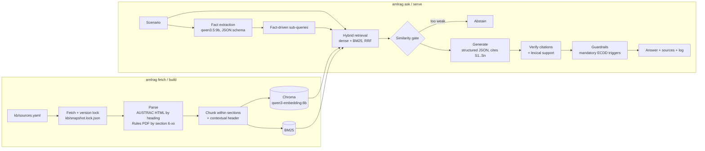

# AML/CTF CDD Compliance Assistant

**WIL Project, Group 94 (RMIT).** A Test-Driven RAG assistant that helps AML/CTF compliance officers determine the correct customer due diligence (CDD) tier for a customer scenario, with every determination cited to the specific AUSTRAC guidance section or AML/CTF Rules 2025 clause it relies on.

Everything runs locally: **Ollama** (`qwen3.5:9b` writes the answers, `qwen3-embedding:8b` searches, `llama3.1:8b` grades answers during evaluation) and **Chroma** as the vector store. No customer data leaves the machine.

> Decision support only. Determinations must be confirmed by a compliance officer against the reporting entity's AML/CTF program.

---

## What it does

| User story | Feature |
|---|---|
| Compliance officer: *which CDD tier applies to this scenario?* | **Determine tier** mode returns `simplified`, `standard`, `enhanced` or `insufficient_information`, with reasoning and required measures. Guardrails stop the model from under-applying CDD when the scenario contains a mandatory enhanced CDD trigger. |
| New team member: *plain-language explanations* | **Explain an obligation** mode: short, plain-English key points, each cited. |
| Compliance officer: *every answer cited so it can be defended in an audit* | Every point carries citations like `AML/CTF Rules 2025, s 6-23` or `AUSTRAC guidance: Enhanced customer due diligence › When you must apply ECDD`, linked to the source. Citations are verified after generation: invented citations are stripped, unsupported points are flagged, and an answer with no valid citation is withheld. |
| Compliance manager: *which questions can't it answer confidently?* | Every query is logged, with identifiers masked and rows deleted after 30 days by default. The **Review gaps** tab lists abstentions, low-confidence answers, guardrail escalations and answers marked *not helpful*. |

## Architecture



Key design choices (each is switchable in `config.yaml`, and the evaluation ablates them):

- **Section-level units.** AUSTRAC pages are split on their headings; the Rules are split on section numbers (`6-23`). Chunks never cross a section boundary, so a citation always names one rule. Chunk IDs are stable: `rules2025::6-23::0`.
- **Contextual header.** Each chunk is embedded with its citation and heading path prepended, so a bare list of KYC fields still matches "trust customer".
- **Embedding prompt format.** Each embedding model expects its own format, and leaving it out noticeably hurts retrieval. Qwen3-Embedding gets a task instruction on queries only (`Instruct: …\nQuery:`); formats for nomic-embed-text, EmbeddingGemma and mxbai are also in `config.yaml → embedding.prompt_formats`, picked automatically by model name. Each embedding model gets its own index folder under `.index/chroma/`, so switching never mixes vectors.
- **Hybrid retrieval.** Legal text rewards exact terms ("source of wealth", "6-18"); BM25 catches those, dense retrieval catches paraphrase. Fused with reciprocal rank fusion.
- **Fact extraction.** An 8B model reading a long scenario can miss the one decisive fact. The model first extracts a fixed set of CDD facts (PEP status, jurisdiction, SMR, risk rating…); each positive fact becomes a targeted sub-query, and the facts feed the guardrails.
- **Structured output.** Ollama JSON-schema constrained generation, `temperature 0`, fixed seed, `num_ctx 8192`. Ollama's default context window silently truncates prompts with 8 sources. Qwen 3.5's "thinking" phase is switched off (`generation.think: false`): it is slow and its reasoning can leak into the JSON.
- **Verification.** Model citations are mapped back to retrieved chunks; labels that weren't retrieved are removed; each point's lexical support in its cited text is scored; confidence can only go down from what the model claims.
- **Guardrails.** Under-applying CDD is the costly error. If the scenario contains a mandatory ECDD trigger (foreign PEP, FATF call-for-action jurisdiction, SMR with continuing relationship, nested services, unusual transaction, high risk rating) and the model said otherwise, the tier is escalated to `enhanced` **only if a retrieved source covers the trigger**, and that source is cited. The answer is flagged for review.
- **Abstention.** If no retrieved passage is similar enough, the assistant says so instead of generating. The model can also return `insufficient_information` and list what is missing.
- **Version lock.** The AML/CTF reform rolled out 31 March to 1 July 2026 and guidance is still being revised. Sources are fetched once, hashed and locked; `amlrag fetch --refresh` reports what changed.
- **Privacy.** Questions can contain customer details. Before a question is logged, emails, phone numbers, dates, addresses, long numbers (account, card, TFN, ABN) and most names are masked; the log keeps only system-generated reasons, never the model's wording; rows expire after `query_log.retention_days`. Set `query_log.store_text: none` to keep outcomes only. `amlrag log --purge-all` clears it. A lone first name at the start of a sentence is not caught, so the UI asks staff not to type names.

## How we show it adds value

A working pipeline isn't enough on its own; the evaluation is built to answer "is this better than the alternative, and for whom?":

- **Against the model on its own.** The `closed_book` preset runs the answer model with no retrieval and asks it to name its legal basis. Its references are parsed and checked against the snapshot, so the report shows how often the bare model gets the tier wrong and how often it cites rules that don't exist (or the repealed 2007 Rules). The gap to the `full` column is what RAG adds.
- **Against Walert.** The same measures Walert reported: % unanswered for out-of-knowledge-base questions, graded NDCG@1/3/5 for known and inferred questions, ROUGE-1 and BERTScore against written reference answers.
- **Fairness.** 12 counterfactual variants change only a customer's name, country of birth, or which foreign country a PEP serves. The tier must not change (`fairness_tier_flip_rate_max: 0.0`).
- **What the business cares about.** Under-application rate (the regulatory-exposure error), mandatory-ECDD recall, citation validity (can the answer be defended in an audit) and latency.

## Quick start

**Prerequisites:** Python 3.10+, [Ollama](https://ollama.com) 0.5 or newer (for JSON-schema structured outputs) running locally.

```bash
ollama pull qwen3-embedding:8b # search (4.7 GB)
ollama pull qwen3.5:9b         # answers (6.6 GB)
ollama pull nomic-embed-text   # optional: Milestone 1 embedding model, for the comparison
ollama pull llama3.1:8b        # grades answers during evaluation; also the Milestone 1 baseline
ollama pull qwen3.5:4b         # optional: faster fallback for the live demo (--fast)

python -m venv .venv
source .venv/bin/activate      # Windows: .venv\Scripts\activate
pip install -e ".[dev]"

amlrag doctor                  # checks Ollama, models, snapshot, index
```

**1. Build the knowledge base (once per snapshot)**

```bash
amlrag fetch                   # downloads AUSTRAC CDD guidance + crawls in-scope sub-pages; writes kb/snapshot.lock.json
```

Then put the legislation in `kb/manual/` (the Federal Register's download links change with each compilation, so these are placed by hand):

- `kb/manual/rules2025.pdf`: latest compilation of the AML/CTF Rules 2025 from <https://www.legislation.gov.au/F2025L01026/latest> (it must include the 2026 amendments).
- `kb/manual/amlctf-act.pdf` *(optional, recommended)*: latest compilation of the AML/CTF Act 2006 from <https://www.legislation.gov.au/C2004A01550/latest>.

```bash
amlrag fetch                   # records the manual files in the lock too
amlrag build                   # parse -> chunk -> embed -> index
amlrag stats --grep "6-23"     # sanity-check that rule sections parsed
```

Review `kb/snapshot.lock.json` and the per-document chunk counts that `build` prints. A document with 0 or 1 chunks means the parser didn't find its structure; see *Troubleshooting*.

**2. Use it**

```bash
amlrag ask "A company's 45% shareholder is a serving member of a foreign parliament. Business account."
amlrag ask --mode explain "What is the difference between source of wealth and source of funds?"
amlrag ask --closed-book "…"   # the same question with no retrieval, for side-by-side demos
amlrag serve                   # http://127.0.0.1:8000
amlrag serve --fast            # uses generation.fallback_model (qwen3.5:4b)
```

**3. Evaluate**

```bash
amlrag eval                    # full pipeline over data/gold/scenarios.jsonl -> results/<timestamp>-full/
amlrag eval --preset all       # closed_book -> baseline -> hybrid -> +facts -> +guardrails, plus comparison.md
amlrag eval --preset closed_book
amlrag eval --tags fairness    # only the counterfactual groups (bases are kept automatically)
amlrag eval --limit 5          # quick smoke run
amlrag eval --judge lexical    # skip the LLM judge (faster, cruder faithfulness)

pip install -e ".[walert]"     # optional: adds BERTScore (PyTorch + roberta-large, ~1.4 GB download on first run)
```

Each run writes `predictions.jsonl`, `metrics.json`, `config_used.yaml` and a `report.md` with acceptance results, confusion matrix, per-customer-type accuracy, confidence calibration, consistency groups, Walert-comparable measures, counterfactual fairness and every failure with its retrieved and cited sources. See [docs/evaluation.md](docs/evaluation.md).

The full gold set is 74 items. On a laptop with the LLM judge, budget roughly a minute per item per preset; `--preset all` runs five presets, so start it before a break or use `--judge lexical` while iterating.

**4. Tests**

```bash
pytest                                       # offline unit + integration tests (no Ollama needed)
AMLRAG_RUN_EVAL=1 pytest tests/acceptance -v # live acceptance tests against config.yaml thresholds
```

On Windows PowerShell: `$env:AMLRAG_RUN_EVAL="1"; pytest tests/acceptance -v`.

The acceptance tests are the "test" in Test-Driven RAG: each threshold in `config.yaml → eval.thresholds` (for example `mandatory_ecdd_recall: 1.0`, `under_application_rate_max: 0.05`) is its own test, so a change to chunking, prompts or retrieval that regresses a property fails loudly.

## Choosing the models

### Answer model

`config.yaml → generation.model` is `qwen3.5:9b`. It replaced the Milestone 1 choice, `llama3.1:8b`, because it is two years newer and scores far higher on published knowledge and reasoning benchmarks at a laptop-friendly size (6.6 GB). The benchmarks don't measure citing legal text correctly, so compare the two on your own gold set and report what you find:

```bash
amlrag eval --preset full --model llama3.1:8b
amlrag eval --preset full                        # qwen3.5:9b from config.yaml
amlrag compare results/<llama run> results/<qwen run>
```

Results folders are named after the preset and model (e.g. `20261002-1410-full-qwen3.5-9b`), and `amlrag compare` puts any finished runs side by side, warning if they used different indexes or item counts. `--model` also works with `ask` and `serve`.

- **Judge.** `eval.judge_model` stays `llama3.1:8b`, a different model family from the answer model, so answers aren't graded by the model that wrote them. If you evaluate with `--model llama3.1:8b`, switch the judge (e.g. `--judge lexical`, or `judge_model: qwen3.5:9b`) for that run.
- **Memory.** On a 16 GB Mac the answer model and the judge don't both fit at once, so Ollama swaps them during evaluation. It works, just slower; `--judge lexical` avoids it while iterating. With 32 GB+, `qwen3.5:27b` is a large step up.
- **Thinking.** `generation.think: false` switches off Qwen 3.5's reasoning phase. Set it to `null` to leave the model's default. Models that can't think ignore it; if your Ollama version rejects it, the client drops it automatically.

### Embedding model

`config.yaml → embedding.model` is `qwen3-embedding:8b`, replacing the Milestone 1 choice, `nomic-embed-text`. It was No. 1 on the multilingual MTEB leaderboard when released (June 2025) and scores well above nomic on published retrieval benchmarks, though the two models' published scores come from different MTEB versions. It is also 4.7 GB instead of 0.3 GB. Compare the two on your gold set:

```bash
amlrag build                                          # qwen3-embedding:8b index
amlrag build --embedding-model nomic-embed-text       # second index, kept alongside
amlrag eval --preset full --judge lexical
amlrag eval --preset full --judge lexical --embedding-model nomic-embed-text
amlrag compare results/<qwen3-embedding run> results/<nomic run>
```

Look at `retrieval_recall_at_k` and `walert_ndcg_at_5` first; those isolate search quality. After switching embedding models, recalibrate `retrieval.min_dense_similarity` (see `docs/evaluation.md`): similarity scores sit in different ranges for different models.

**Memory on a 16 GB Mac:** the embedding model (4.7 GB) and the answer model (6.6 GB) don't both fit in the memory macOS gives the GPU, so Ollama loads one, then the other, for each question. Answers still work but each takes several seconds longer. If that's too slow for the demo, `--embedding-model qwen3-embedding:4b` (2.5 GB, rebuild its index first) fits alongside the answer model.

## Working without Ollama (frontend work, CI)

```bash
amlrag build --offline && amlrag serve --offline
```

`--offline` swaps in a hashing embedder and a keyword stub generator. The UI shows a red banner; the answers are **not** model output. The index records which embedder built it, so rebuild with plain `amlrag build` before real use (the app refuses to query a mismatched index).

## Project layout

```
config.yaml                 runtime config + acceptance thresholds (env override: AMLRAG_SECTION__KEY=value)
kb/sources.yaml             source manifest (AUSTRAC pages, legislation, crawl scope)
kb/snapshot.lock.json       what was fetched: URL, time, sha256  (created by `amlrag fetch`)
kb/manual/                  hand-placed legislation PDFs
data/gold/scenarios.jsonl   gold-standard test set (74 draft items: 47 scenarios, 12 counterfactuals, 15 questions)
src/amlrag/
  ingest/                   fetch.py, parse_html.py, parse_legislation.py, chunk.py, build.py
  index/store.py            Chroma build/query + index manifest
  retrieve/                 bm25.py, hybrid.py (RRF), facts.py (fact extraction + sub-queries)
  generate/                 prompts.py, verify.py, guardrails.py, references.py (closed-book reference parsing)
  backends/                 ollama.py (REST client), offline.py (test doubles)
  pipeline.py               Assistant.determine / Assistant.explain
  querylog.py, redact.py    SQLite log behind the Review gaps tab; identifier masking
  eval/                     gold.py, metrics.py, textmetrics.py (ROUGE-1, BERTScore), judge.py, runner.py, report.py
  server/                   FastAPI app + static UI (no build step)
tests/                      offline tests; tests/acceptance = live gold-set thresholds
docs/evaluation.md          metric definitions, calibration and review procedure
```

## Mapping to the three-week plan

| Week | Plan | Where it lives |
|---|---|---|
| 1 | Knowledge base, chunking, nomic-embed-text + Chroma, Ollama llama3.1:8b, basic assistant | `amlrag fetch`, `amlrag build`, `amlrag ask` (the models have since moved to `qwen3.5:9b` and `qwen3-embedding:8b`; see *Choosing the models*) |
| 2 | Gold set of ~35-40 scenarios; test retrieval, answers and citations; tune chunking and prompts; browser UI | `data/gold/`, `amlrag eval`, `config.yaml → chunking/retrieval`, `generate/prompts.py`, `amlrag serve` |
| 3 | Effectiveness, faithfulness, attribution, consistency across customer types; final improvements; demo | `amlrag eval --preset all`, `report.md`, `comparison.md` (with the closed-book baseline, Walert measures and fairness) |

The ablation presets also map onto the brief's iterations: run `baseline` on the real snapshot first (the skateboard), then add `hybrid` and `hybrid_facts` (the scooter), then `full` with guardrails (the racing kart), recording each result on Trello as you go.

## Before you rely on the numbers

1. **The gold set is a draft.** All 74 items are `status: draft`. The expected tiers and reference answers were written from secondary summaries of Part 6 of the Rules and AUSTRAC's guidance structure, and several items are marked in `notes` as needing confirmation. Each item should be checked against the locked snapshot and set to `status: reviewed` with a `reviewer` (see [data/gold/README.md](data/gold/README.md)). Reports print how many items are still draft.
2. **The parsers were developed against synthetic fixtures**, because AUSTRAC and the Federal Register weren't reachable from the build environment. After the first real `fetch` + `build`, check chunk counts and a few sections with `amlrag stats --grep`. The HTML parser looks for `<main>`, then `role=main`, then `<article>`; if AUSTRAC's markup differs, adjust `_main_region` / `_DROP_SELECTORS` in `ingest/parse_html.py`.
3. **Calibrate `retrieval.min_dense_similarity`** on your real index using the unanswerable items (procedure in `docs/evaluation.md`).
4. **Section numbers.** Gold references use Rules 2025 numbering (`rules2025::6-23`). If the 2026 amendments renumbered anything in the compilation you lock, update the references.

## Troubleshooting

| Symptom | Fix |
|---|---|
| `Is Ollama running at http://localhost:11434?` | `ollama serve`, then `amlrag doctor`. |
| `No index at .index/chroma/<model>` | That embedding model has no index yet: `amlrag build` (add `--embedding-model <name>` if you're using a different one). |
| Everything is refused ("no guidance close enough") | `retrieval.min_dense_similarity` is too high for this embedding model; calibrate it (docs/evaluation.md). |
| `chunks.jsonl changed since the index was built` | Run `amlrag build` (it rebuilds both). |
| A legislation document yields few sections | Print a page of extracted text and compare it with `section_pattern` in `kb/sources.yaml`: `python -c "from pathlib import Path; from amlrag.ingest.parse_legislation import pdf_to_pages; print(pdf_to_pages(Path('kb/manual/rules2025.pdf'))[40])"` |
| Answers are slow (> 30 s) | Check `generation.think` is `false`; `amlrag serve --fast` (uses `qwen3.5:4b`); lower `retrieval.final_k` to 6; set `retrieval.use_fact_extraction: false` (one fewer model call). |
| `model did not return valid JSON` | Update Ollama (0.9+ keeps thinking out of the answer), or try `--model llama3.1:8b` to confirm it's model-specific. |
| Warning "prompt filled the context window" | Raise `generation.num_ctx` or lower `retrieval.final_k` / `chunking.max_words`. |

## Sources in the knowledge base

AUSTRAC *Customer due diligence* guidance (overview; initial CDD and customer-type guides; delayed initial CDD; enhanced CDD; politically exposed persons; ongoing CDD; customer risk ratings; transitioning existing customers; reliance; high-risk countries), plus Parts 1 and 6 of the *Anti-Money Laundering and Counter-Terrorism Financing Rules 2025* and, optionally, Parts 1-2 of the *AML/CTF Act 2006*. The exact list and URLs are in `kb/sources.yaml`. AUSTRAC and Federal Register content is Commonwealth material; check each site's copyright notice before redistributing the raw snapshot.
